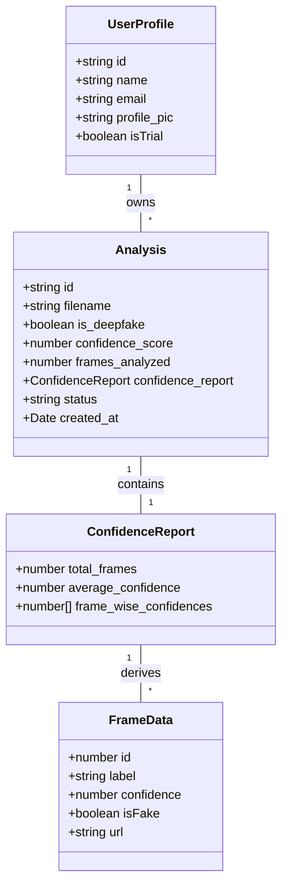
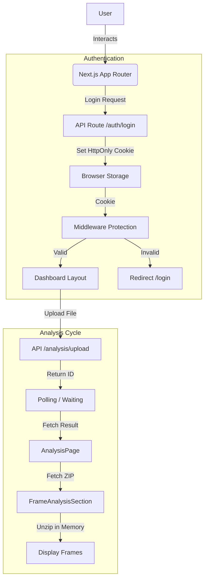

# Frontend Architecture

This document provides a comprehensive overview of the frontend architecture for the **Deep Guard** application. The frontend is designed to be performant, responsive, and provide a seamless user experience for uploading and analyzing media for deepfakes, featuring robust security and a polished UI.

## 🏗️ High-Level Overview

The application is built as a **Single Page Application (SPA)** using **Next.js 15** with the **App Router**. It follows a hybrid rendering model where critical initial loads and SEO-sensitive pages use Server Components, while interactive elements use Client Components.

-   **Routing:** File-system based routing via Next.js App Router (`src/app`).
-   **Rendering:** Hybrid (Server Components + Client Components).
-   **State Management:**
    -   **Global:** Zustand (`useAnalysisStore`) for analysis sessions.
    -   **Server:** React Server Components for initial data fetching (e.g., in `DashboardLayout`).
    -   **Local:** React `useState`/`useReducer` for component-level logic.
-   **Styling:** Utility-first CSS with **Tailwind CSS**.
-   **Theming:** Dark/Light mode support via **next-themes** with persistent storage.
-   **Animations:** High-performance animations using **GSAP** (GreenSock) and custom hooks.

## 🛠️ Key Technologies

| Technology | Purpose |
| :--- | :--- |
| **Next.js 15** | Core framework for routing, SSR/CSR, and optimizations. |
| **React 18** | UI library for component-based architecture. |
| **TypeScript** | Static typing for type safety and developer experience. |
| **Tailwind CSS** | Styling and responsive design system. |
| **Zustand** | Lightweight global state management for analysis workflows. |
| **GSAP** | Advanced animations (timeline control, scroll triggers). |
| **Framer Motion** | Declarative layout transitions (optional/legacy). |
| **Lucide React** | Scalable vector icons. |
| **JSZip** | Handling ZIP downloads/parsing for analysis reports in the browser. |

## 🧩 Component Data Models

The frontend relies on strict TypeScript interfaces to maintain data integrity across components.

## 📂 Directory Structure Strategy

The project follows a modular structure efficiently organizing pages, components, and logic:

-   `src/app/`
    -   `layout.tsx`: Root layout, includes `ThemeProvider` and global font settings.
    -   `page.tsx`: Landing page (redirects or static home).
    -   `(auth)/`: Grouped route for `login` and `signup` pages.
    -   `dashboard/`: authenticated workspace.
        -   `layout.tsx`: **Crucial.** Performs server-side auth status check via cookies before rendering the `Sidebar` and children.
        -   `page.tsx`: Main dashboard view composition.
        -   `new-analysis/`: Upload interface.
        -   `history/`: List of past analyses with filtering.
        -   `account/`: User settings and trial restrictions.
    -   `try-without-account/`: Public route for guest access.

-   `src/components/`
    -   **Layout:** `Sidebar.tsx` (responsive with mobile drawer), `SidebarGuide.tsx`.
    -   **Dashboard:** `DashboardStatCard.tsx` (fetches stats), `DashboardWelcome.tsx` (time-based greeting), `DashboardQuickActions.tsx`.
    -   **Analysis:**
        -   `AnalysisPage.tsx`: Main container logic.
        -   `FrameAnalysisSection.tsx`: Visualizes frame-by-frame results, handles ZIP parsing.
        -   `ConfidenceOverTimeChart.tsx`: Visualizes temporal deepfake probability.
        -   `ImageAnalysisSection.tsx`: Handles single image results.
    -   **User:** `UserProfileCard.tsx`, `AccountSettings.tsx` (profile/password/danger zone).

-   `src/hooks/`
    -   **Animation Hooks:** A dedicated pattern where animation logic is extracted from components.
        -   `useDashboardAnimations.ts`: Entrance animations for dashboard cards.
        -   `useAnalysisResultsAnimation.ts`: Sequenced reveals for results.
        -   `useLoginAnimation.ts`: Hero animations for auth pages.
    -   **Logic Hooks:** `useAccountPageAnimations.ts` etc.

-   `src/lib/`
    -   `api.ts`: **Core Utility.** Wrapper around `fetch` that handles `API_URL` prefixing, credential inclusion (`include`), and **automatic 401 token refresh logic**.
    -   `auth.ts`: Logout helpers.
    -   `store/`: Zustand stores.

## 📊 System Workflow

### Client-Side Data Flow

## 🔄 Data Flow & State Management

### 1. Analysis Workflow
1.  **Upload:** User uploads a file via `DashboardQuickActions` or `NewAnalysis`.
2.  **Processing:** Backend processes file; Frontend polls or waits for response.
3.  **Visualization (`AnalysisPage`):**
    -   Fetches specific analysis ID.
    -   If **Video**: Renders `ConfidenceOverTimeChart` and `FrameAnalysisSection`.
    -   If **Image**: Renders `ImageAnalysisSection`.
    -   **ZIP Handling:** `FrameAnalysisSection` fetches a ZIP blob from the backend, unzips it in memory using `JSZip`, and generates Object URLs to display individual frame images without multiple round-trips.

### 2. Authentication Flow
-   **Session:** Maintained via `httpOnly` secure cookies (`accessToken`, `refreshToken`).
-   **Middleware/Layout Protection:**
    -   `src/app/dashboard/layout.tsx` performs a server-side fetch to `/api/account/me` using incoming request cookies.
    -   If 401, it redirects to `/login` *before* the page loads (Server-Side Protection).
    -   `middleware.ts`: Likely handles path matching to protect `/dashboard` routes at the edge.
-   **Auto-Refresh:** `apiFetch` interceptor catches 401 errors, attempts to refresh the token via `/auth/refresh`, and retries the original request transparently.
-   **Guest Mode:** Dedicated `/try-without-account` flow hits `/api/trial/join` to establish a stateless, limit-restricted session.

### 3. Trial System Architecture
-   **Identification:** Users are flagged as `isTrial` or have specific emails (e.g., `guest@trial.com`).
-   **Frontend Restrictions:**
    -   `AccountSettings`: Shows a blur overlay blocking profile edits.
    -   `AnalysisHistory`: Blocks access to history view with a specific empty state.
    -   `DashboardStatCard`: Shows "N/A" or prompts for signup if trial stats are restricted.

## 🎨 UI/UX Design System

-   **Responsiveness:**
    -   **Sidebar:** Fixed on desktop, collapsible drawer (Overlay) on mobile.
    -   **Grids:** `grid-cols-1` (Mobile) -> `md:grid-cols-2/3` (Desktop).
    -   **Padding:** Dynamic `p-4` vs `p-8` based on viewport.
-   **Visuals:**
    -   **Gradients:** Heavy use of linear gradients (Blue→Pink / Cyan→Purple) for buttons, text clips, and borders.
    -   **Dark Mode:** `dark:` variants for all colors (slate-900 backgrounds, cyan accents).
    -   **Micro-interactions:** Hover lifts (`-translate-y`), pulse effects, and GSAP entrance animations.

## 🔐 Security Measures

-   **Cookie-Based Auth:** No tokens stored in `localStorage` (mitigates XSS).
-   **Credentials Include:** All fetch requests explicitly set `credentials: "include"`.
-   **Server-Side Gating:** Dashboard layout prevents unauthorized rendering.
-   **Trial Isolation:** Guest users are visually and functionally walled off from persistent features.
